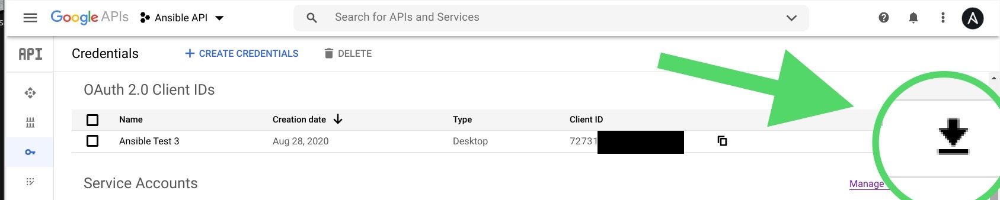

# Check Calendar

Simple app to verify whether a timeslot is taken/busy or not from Ansible.

## Requirements

### Go

If you want to compile the examples, you need Go installed. Otherwise you can use the binaries included for convenience in [here](roles/go-role/library).


### Google Calendar API

You need to [turn on the Google Calendar API](https://developers.google.com/calendar/quickstart/go#step_1_turn_on_the) and download your OAuth 2.0 client credentials (json file) from [API Credentials](https://console.developers.google.com/apis/credentials) as in the image below.

<p align="center">
  <br>
  <br>
</p>

Name this file as `desktop.json`, as we reference it in the code.

```go
b, err := ioutil.ReadFile("desktop.json")
if err != nil {
	return false, fmt.Errorf("Unable to read client secret file: %v", err)
}
```

The file `token.json` will be automatically generated once an API Token has been granted. Store this file securely as it will have a refresh token that never expires.

## Compiling

To compile your own binaries for multiple target Operating Systems (`GOOS`), run `make compile`. The binaries in this repo were compiled in an `amd64` platform (`GOARCH`).

## Testing

### Manually

Execute `make test-manual`. You need an arguments file named `args.json` with something like:


```json
{
    "Name": "Test",
    "Time":  "2020-09-01T19:50:00Z"
}
```

### From Ansible

Execute: `make test-ansible`.

```yaml
...
- name: Test the module (from role)
  calendar_linux:
    name: Testing the Calendar module
    time: "{{ ansible_date_time.iso8601 }}"
  register: output
...
```

 Output

 ```ruby
$ make test-ansible
[WARNING]: provided hosts list is empty, only localhost is available. Note that the implicit localhost does not match 'all'

PLAY [Test Calendar module] **********************************************************************************************************************************

TASK [Gathering Facts] ***************************************************************************************************************************************
ok: [localhost]

TASK [Print the time (ISO 8601) - Module input] **************************************************************************************************************
ok: [localhost] => {
    "ansible_date_time.iso8601": "2020-09-02T17:53:43Z"
}

TASK [go-role : Test the module (from role)] *****************************************************************************************************************
included: /home/centos/check-calendar/roles/go-role/tasks/Linux.yml for localhost

TASK [go-role : Test the module (from role) on Linux [Linux]] ************************************************************************************************
ok: [localhost]

TASK [Print out Calendar module output] **********************************************************************************************************************
ok: [localhost] => {
    "output": {
        "busy": true,
        "changed": false,
        "failed": false,
        "msg": "The timeslot 2020-09-02T17:53:43Z is busy: true"
    }
}

PLAY RECAP ***************************************************************************************************************************************************
localhost                  : ok=5    changed=0    unreachable=0    failed=0    skipped=0    rescued=0    ignored=0
 ```